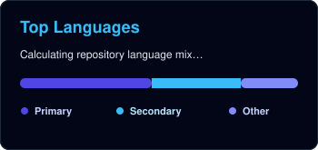

<div align="center">


[](https://git.io/typing-svg)

<a href="https://github.com/twoimo">
  
</a>
<a href="https://github.com/twoimo?tab=followers">
  
</a>
<a href="https://github.com/twoimo?tab=stars">
  
</a>

**I turn data, models, and product ideas into things people can actually use.**

</div>

---

## About me

- Building **end-to-end AI products** across computer vision, data, and full-stack engineering
- Currently shipping **[Tzudong Map](https://github.com/twoimo/tzudong)** and exploring agent-assisted product workflows
- Focused on measurable, maintainable systems that move from prototype to production

---

## Featured builds

<table>
<tr>
<td width="100%" valign="top">

### [Tzudong Map](https://github.com/twoimo/tzudong)
A map-first restaurant product that turns places featured in Tzuyang videos into searchable discovery, community, admin, storyboard, and evidence-pipeline workflows.

**Scope:** Live service · 5 product surfaces · 10-cut AI storyboard


[](https://tzudong.app)

</td>
</tr>
<tr>
<td width="100%" valign="top">

### [Snapish](https://github.com/SnapishAgent/Snapish)
A YOLOv11-powered web service that recognizes 17 fish and marine species and explains closed-season and minimum-size rules, with catch records and fishing-spot data.

**Impact:** 17 species · 1,500+ training images · 88% mAP50


</td>
</tr>
</table>

---

## Stack & tools

<div align="center">


</div>

---

## Current signal

```text
Product      Tzudong Map: discovery, community, admin, and content tools
Vision       Object detection and image-driven user experiences
Data         Analysis pipelines that turn raw evidence into decisions
Engineering  Full-stack systems that survive the jump from demo to production
```

---

## GitHub activity

<div align="center">

[](https://github.com/ashutosh00710/github-readme-activity-graph)

<a href="https://github.com/twoimo">
  
</a>
<a href="https://github.com/twoimo?tab=repositories">
  
</a>

</div>

---

## Contribution snake

<div align="center">

<picture>
  <source media="(prefers-color-scheme: dark)" srcset="https://cdn.jsdelivr.net/gh/twoimo/twoimo@output/github-contribution-grid-snake-dark.svg" />
  <source media="(prefers-color-scheme: light)" srcset="https://cdn.jsdelivr.net/gh/twoimo/twoimo@output/github-contribution-grid-snake.svg" />
  
</picture>

</div>

---

## Let's build something useful

<div align="center">

Open to opportunities and collaborations in **AI Product Engineering, Computer Vision, and Full-Stack Development**.

[](https://www.linkedin.com/in/twoimo)
[](https://tzudong.app)


**See it clearly. Build it fully. Ship it for real.**

</div>
