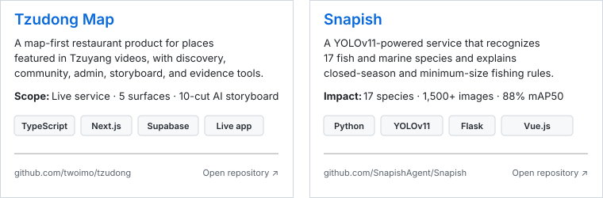

**I turn data, models, and product ideas into things people can actually use.**

---

## About me

- Building **end-to-end AI products** across computer vision, data, and full-stack engineering
- Currently shipping **[Tzudong Map](https://github.com/twoimo/tzudong)** and exploring agent-assisted product workflows
- Focused on measurable, maintainable systems that move from prototype to production

---

## Featured builds

<picture>
  <source media="(max-width: 640px)" srcset="./profile/featured-builds-mobile.svg" />
  
</picture>

---

## Stack & tools

---

## GitHub activity

---

## Contribution snake

<picture>
  <source media="(prefers-color-scheme: dark)" srcset="https://cdn.jsdelivr.net/gh/twoimo/twoimo@output/github-contribution-grid-snake-dark.svg" />
  <source media="(prefers-color-scheme: light)" srcset="https://cdn.jsdelivr.net/gh/twoimo/twoimo@output/github-contribution-grid-snake.svg" />
  
</picture>

---

## Let's build something useful

Open to opportunities and collaborations in **AI Product Engineering, Computer Vision, and Full-Stack Development**.

**See it clearly. Build it fully. Ship it for real.**

