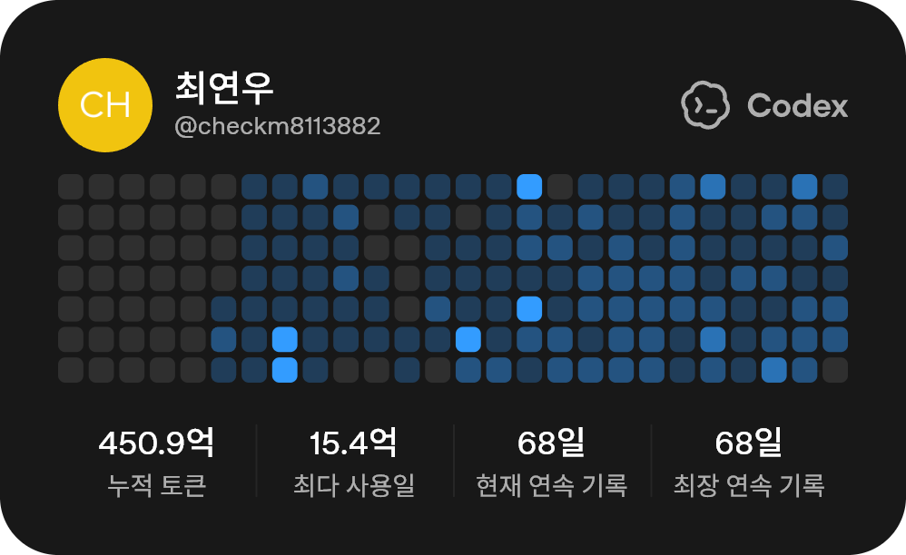

<div align="center">

# Yeonwoo Choi · 최연우

### AI × Web × Security — building data-driven products from research to interface

<p>
  <a href="https://github.com/twoimo"></a>
  <a href="https://github.com/twoimo?tab=repositories"></a>
  <a href="https://komarev.com/ghpvc/?username=twoimo"></a>
</p>

<p>
  <a href="https://www.linkedin.com/in/twoimo"></a>
  <a href="mailto:twoimo@dgu.ac.kr"></a>
</p>

<sub>Seoul, South Korea · M.S. Computer Engineering, Dongguk University</sub>

</div>

---

## Snapshot

<table>
  <tr>
    <td width="33%" valign="top">
      <b>Computer Vision / AI</b><br />
      Fall detection, synthetic data generation, skeleton-based human action recognition, multi-object tracking, and YOLO-based model validation.
    </td>
    <td width="33%" valign="top">
      <b>Web Products</b><br />
      Next.js, Vue.js, TypeScript, APIs, maps, and practical UX around real datasets instead of demo-only prototypes.
    </td>
    <td width="33%" valign="top">
      <b>Security / Public Safety</b><br />
      Secure S/W training, blockchain-based CCTV blind-spot crowdsourcing, cybersecurity competitions, and public-sector research projects.
    </td>
  </tr>
</table>

```txt
Building        Tzudong — restaurant map platform for places people actually visit
Exploring       Agentic development with Claude Code & Codex CLI
Research DNA    Synthetic data, fall detection, CCTV/public-safety AI
Work style      Define the problem → design the data → validate the model → ship the interface
```

## Tech I use

<p>
  
  
  
  
  
  
  
  
  
  
  
  
</p>

## Selected work

| Project | What I did | Notes |
|---|---|---|
| [Tzudong](https://github.com/twoimo/tzudong) | Restaurant map platform with data cleaning, map UI, and API design | Next.js · TypeScript · map UX |
| [Snapish](https://github.com/twoimo/Snapish) | AI web service for beginner anglers to classify fishing closed seasons | YOLOv11m · 16 classes · 1,509 images · mAP50 0.995 |
| [Ilsan Investment Insight](https://github.com/twoimo/Ilsan-Investment-Insight) | Real-estate analysis comparing first-generation new-town reconstruction areas | Data analysis · HTML report |
| Smart Community Policing System (Googi) | Designed blockchain-based crowdsourcing to reduce CCTV blind spots | Public-safety AI · conference presentation |
| Secure S/W Production Technology | Built theory/practice education content and supported public-institution training labs | Secure coding · NSR project |

## Research & publications

- **Choi, Y.**, Kim, B., & Jeong, J. (2023). *A study on synthetic data generation for fall detection.* IFSA World Congress.
- Kim, B., Kim, S., **Choi, Y.**, & Jeong, J. (2023). *Improving human skeleton-based fall detection for monocular camera.* ICAEIC.
- **Choi, Y.**, Kim, S., Kim, B., & Jeong, J. (2023). *Crowdsourcing method for minimizing CCTV blind spots based on blockchain.* ICFICE.

## Awards & activities

- **1st place**, K-Cyber Security Challenge — AI-based malware detection track, Chungcheong region.
- **Grand Prize** and **Top Excellence Award**, Smart Policing Data Utilization & Application Service Contest.
- Co-founded and led **NIMDA Security**, a university information-security club.
- Led multiple AI/web team projects through planning, data preparation, implementation, and final presentation.

## GitHub pulse

<div align="center">


<br />
<br />


</div>

## Agentic dev snapshot

<p align="center">
  
</p>

---

<div align="center">

**Data first. Product always.**

<sub>Thanks for visiting — repositories are usually where the real story is.</sub>

</div>
